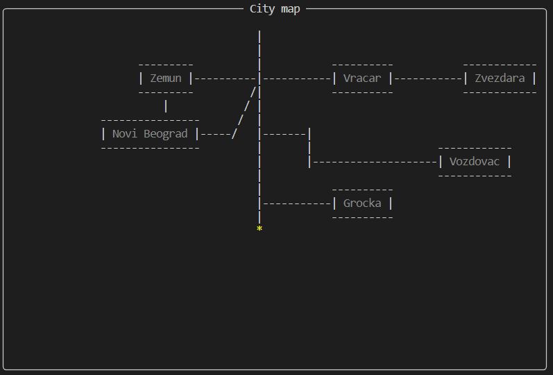
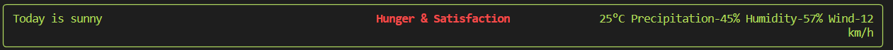

# Hungriness-and-Satisfaction

## Idea and motivation
Ever since i was little i was fascinated by games, and wanted to create one. This course CS50P was one of the first steps towards achieving that goal. Since learing programing is all about being in your discomfort zone and challenging yourself i wanted to learn a new library for this final project.
Library that at the end i choose to learn was "Rich". The idea was to create a fun little game in Terminal and since Rich library is all about making terminal prettier and having more easier control over it, naturally it drew me in. 

## Point of the game
Main point of the game is to go around municipalities in Belgrade and satisfy needs of your characters by buying food.  
  
  
  
Every character has their food preferance and how easily they are irritated. Since every food has certain tags which players dont see but some of them can be guessed based on food that they are buying. Based on those tags different coefficients will be added and it will generate certain points towards the bar "Hungerless". Irritation part comes in to play based on multiple factors. Since every municipalitie has certain distance between them its not the same when needing to travel while the weather is sunny and temperature is ok and traveling when its closer to zero temperature and its snowing. Based on that every character has a characteristic "irritability" which players sees when choosing how easily is that character irritated; all the factors that have a degree of influence are weather, temperature, percipation, humidity, wind and all of them a player can see and judge based on that if he wants to travel a lot or not.  

 
  
Also there are secret combinations of tags, topings, way of food preperation, and some foods that can create powerful synergies and generate a lot of points; example even if said character likes sweets it doesnt mean he/she will like every type of sweets the same or if someone likes meat, maybe they prefer grilled rather than smoked meat.   
You can choose your difficulty and the only thing that it affects is how much money you start of with and in the leaderboard its segregated by difficulty soo you can easily compare results with friends. 

## Libraries Used

`import random, time, datetime, sys, json, rich`

 

